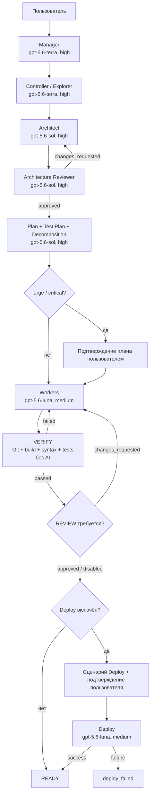

# Схема работы 1C AI Workflow

Пользователь ведёт один диалог с Manager. Manager хранит состояние задачи и назначает специализированных агентов; VERIFY выполняется детерминированными инструментами без AI.

Diagram: основной маршрут задачи (flowchart)



```text
[Пользователь] -> [Manager] -> [Explorer] -> [Architect]
                                           -> [Architecture Reviewer]
                                              | changes -> [Architect]
                                              | approved
                                              v
                              [Plan + Test Plan + Decomposition]
                                              |
                                 large/critical? -- да -> [Подтверждение]
                                              |                    |
                                              +--------------------+
                                              v
                                          [Workers]
                                              |
                                           [VERIFY]
                                  failed -----+----- passed
                                    |                   |
                                    +--> [Workers]   [REVIEW?]
                                                        |
                                                   [Deploy?]
                                              нет /          \ да
                                         [READY]       [Подтверждение]
                                                             |
                                                         [Deploy]
                                                    success / failure
                                                   [READY] [deploy_failed]
```

## Участие пользователя

- исходная постановка и уточнение существенных бизнес-развилок;
- подтверждение плана для `large` и `critical`;
- отдельное подтверждение неизменного Deploy-сценария;
- получение единого результата от Manager после READY.

## Параллельность

`manager.max_parallel_workers` задаёт число одновременно назначаемых Worker. Manager запускает параллельно только независимые work items без пересечения файлов и изменяемой схемы. Фактический предел также ограничивается количеством доступных слотов среды выполнения.

## Сохраняемые артефакты

В `.pipeline/tasks/<task-id>/` сохраняются запрос, состояние, память, журнал решений, архитектура и её ревью, план, тест-план, декомпозиция, результаты Workers, VERIFY evidence, Deploy evidence и итоговый summary.
